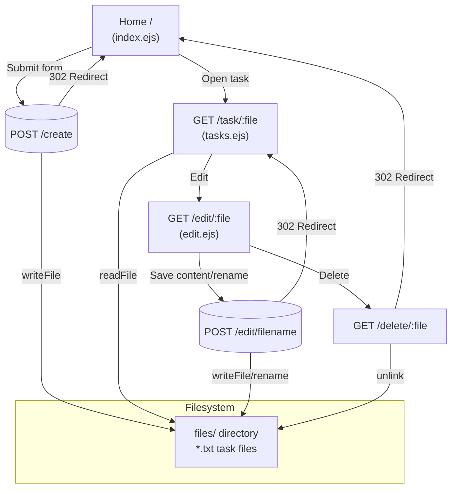
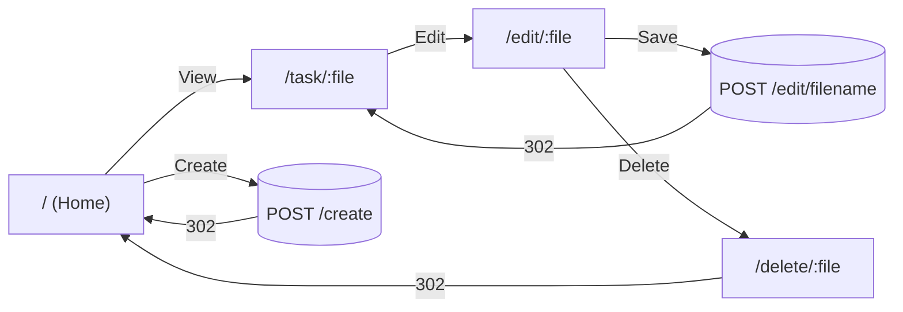
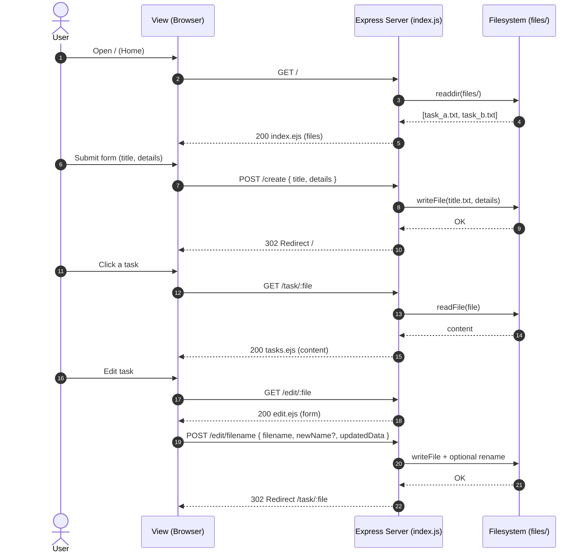
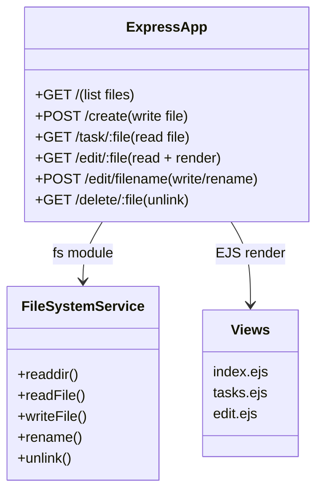
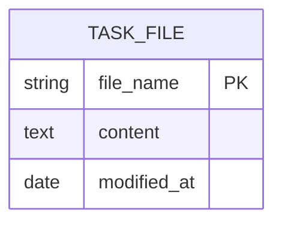
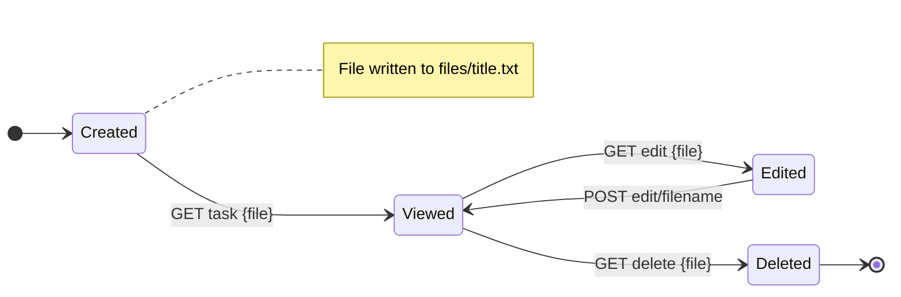

## 📋 Task Manager

<div align="center">
  
  
  <div>
    
    
    
  </div>
  
  <div style="margin-top: 10px;">
    
    
    
    
    
  </div>
</div>

<!-- Optional Live Demo button (uncomment and set URL if available)
<p align="center">
  <a href="https://your-live-demo.example.com/" target="_blank">
    
  </a>
  <br />
  <small>Hosted on your platform • Auto-scaled • Public demo</small>
  </p>
-->

---

### 🚀 Overview

**Task Manager** is a minimal, production-ready web app to create, view, edit, and delete text-based tasks stored as `.txt` files on disk. Built with Node.js, Express, EJS views, and TailwindCSS CDN. It’s fast, simple, and requires no database.

- 🔼 Create a task with title and details
- 👀 View a task in a clean reader
- ✏️ Edit task content and optionally rename the file
- 🗑️ Delete a task safely
- 🗂️ Browse all tasks on the home page

---

### 🛠️ Tech Stack

<div align="center">

| Frontend | Backend | Storage | Tools |
|----------|---------|---------|-------|
|  |  |  |  |
|  |  |  |  |

</div>

---

### 📂 Project Structure

```
📦 Task_Manager_shadowx/
├── index.js               # Express app, routes, server bootstrap
├── files/                 # Auto-created folder for storing .txt tasks (runtime)
├── public/
│   └── javascripts/
│       └── script.js      # Client JS (optional; currently empty)
├── views/
│   ├── index.ejs          # Home: create form + list of tasks
│   ├── tasks.ejs          # View a single task (read-only)
│   └── edit.ejs           # Edit task title/content and rename file
├── package.json
└── README.md
```

---

### 🔗 Pages & Flow

- **Home (`GET /`)**: Lists all tasks and displays a form to create a new task.
- **Create (`POST /create`)**: Creates a `.txt` file named after the title (spaces → underscores) with the details as content. Redirects back to Home.
- **View (`GET /task/:file`)**: Opens a specific task in a read-only view.
- **Edit (`GET /edit/:file`)**: Opens edit UI to change content and optionally rename the file.
- **Save Edit (`POST /edit/filename`)**: Writes updates; if `newName` is provided, attempts to rename.
- **Delete (`GET /delete/:file`)**: Deletes the chosen task and returns to Home.



#### Navigation Map (Pages and Links)



---

### 🧠 How It Works

1. On startup, the app ensures a `files/` directory exists.
2. The Home page reads all filenames in `files/` and renders them.
3. Creating a task writes a new `.txt` file containing the provided details.
4. Viewing a task reads the file and renders its content.
5. Editing writes updated content and optionally renames the file.
6. Deleting removes the file from disk.



#### Module Relationship Diagram



#### Task Entity (ER Perspective)



#### Task Lifecycle



---

### 🧩 API & Routes

| **Method** | **Path**             | **Purpose**                           | **Request Body**                                 | **Response**                      |
|------------|----------------------|---------------------------------------|--------------------------------------------------|-----------------------------------|
| GET        | `/`                  | Render home with create form + list   | -                                                | HTML                               |
| POST       | `/create`            | Create task as `.txt`                 | `{ title: string, details: string }`             | 302 Redirect to `/`                |
| GET        | `/task/:file`        | View a task                           | -                                                | HTML (`tasks.ejs`)                 |
| GET        | `/edit/:file`        | Render edit UI                        | -                                                | HTML (`edit.ejs`)                  |
| POST       | `/edit/filename`     | Save content and optional rename      | `{ filename, newName?, updatedData }`            | 302 Redirect to `/task/:file`      |
| GET        | `/delete/:file`      | Delete task file                      | -                                                | 302 Redirect to `/`                |

- **Validation & Errors**
  - Title is normalized to a safe filename: spaces → `_`, `.txt` appended.
  - On read/write failures, the server logs the error and redirects to Home.

---

### 🗄️ Storage Model

```txt
files/
  my_task.txt       # File content = task details (plain text)
  another_task.txt
```

- Each task is a plain text file in `files/`.
- File name convention: `<title>.txt` with spaces replaced by underscores.
- No database is required; storage is local filesystem.

---

### ⚙️ Installation & Setup

#### Prerequisites
```bash
Node.js 18+
```

#### Quick Start
```bash
# 1) Clone
git clone <repo-url>
cd Task_Manager_shadowx

# 2) Install deps
npm install

# 3) Run
node index.js
# or (recommended during development)
# npx nodemon index.js
# App on http://localhost:3000
```

---

### 🖥️ Usage Guide

1) Open the Home page `/`.
2) Enter a title and details, click Add Task.
3) Click a task in the list to view it.
4) Click Edit to update content or rename the file.
5) Use Delete from the edit screen to remove the task.

---

### 🛡️ Notes & Considerations

- This app stores tasks as local files; ensure the host has write permissions.
- Filenames are derived from titles; avoid characters not valid for filenames.
- For multi-user or cloud deployment, consider moving to a database or object storage.

---

### 🧭 Roadmap / Enhancements

- Add search and filtering on the home page
- Add confirmation dialog before delete
- Add pagination for large numbers of files
- Add download/export task as `.txt`
- Optional: Switch to a database (e.g., MongoDB) for metadata and auditing

---

### 👨‍💻 Developer

<div align="center">
  
  
  <p><em>Computer Science Student & Aspiring Software Developer</em></p>
  
  <div style="margin: 20px 0;">
    <a href="https://lucky-longre.onrender.com/" target="_blank">
      
    </a>
    <a href="mailto:officialluckylongre@gmail.com">
      
    </a>
    <a href="https://www.linkedin.com/in/lucky-longre/" target="_blank">
      
    </a>
  </div>
  
  <p>
    
    
    
  </p>
</div>

#### 💼 Technical Expertise

<div align="center">

| **Frontend Technologies** | **Backend Technologies** | **Storage & Tools** |
|---------------------------|--------------------------|---------------------|
| HTML5, CSS3, JavaScript, Tailwind | Node.js, Express.js, REST | Filesystem (FS) |
| EJS, Responsive Design | Basic Auth/Validation | Git, GitHub |
| Basic jQuery/AJAX | File I/O (fs) | Postman, VS Code |

</div>

#### 🚀 Development Philosophy

- **Problem-Solving First**: Understand the user problem before writing code.
- **User-Centric Design**: Keep flows simple, fast, and accessible.
- **Security-Minded**: Validate inputs and protect data by default.
- **Performance Focused**: Favor efficient, maintainable implementations.
- **Continuous Learning**: Iterate with feedback and new best practices.

#### 📈 Goals

- **Short-term**: Build and ship practical, production-ready web apps.
- **Medium-term**: Deepen expertise in scalable backends and storage.
- **Long-term**: Lead full-stack projects and mentor budding developers.

---

<p align="center">
  
  <br />
  <strong>Task Manager</strong> — Simple, fast, and focused on productivity.
  <br />
  <sub>Made with Node.js, Express, and EJS.</sub>
</p>


